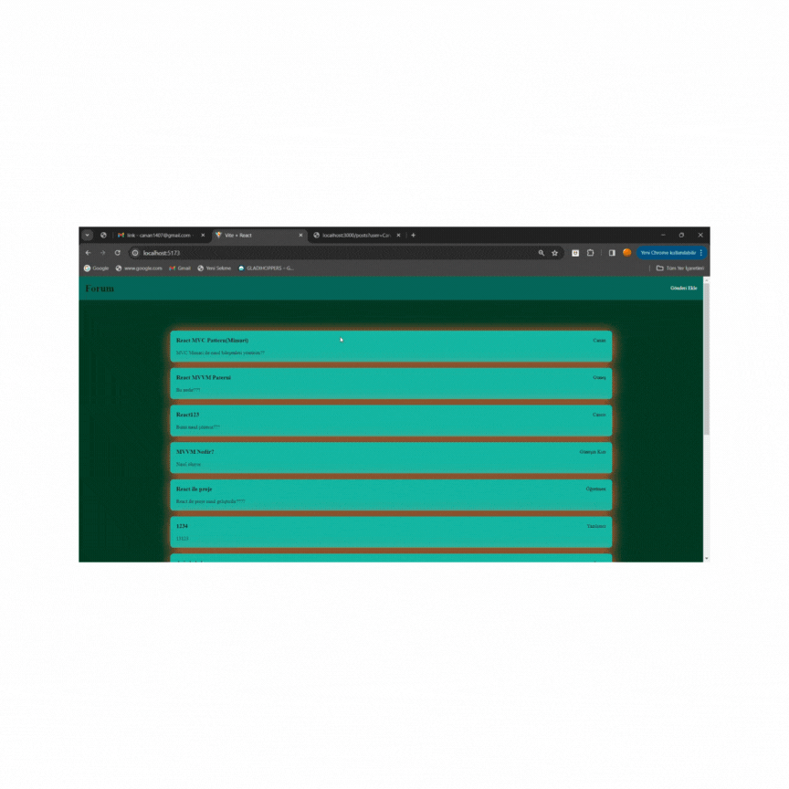

# form_MVC-App
## home page
✅ form_MVC Project

💻 MVC (Model-View-Controller) architecture is a commonly used architectural design pattern in software development. This architecture separates the components of an application into data, user interface, and business logic, making the code more organized, easier to maintain, and reusable.
📊 A form project created with the MVC architecture typically follows the following basic structure:

1. ⏩ Model: This is the part where data is processed and stored. In a form project, the data entered by users is usually processed and stored in this part. For example, when a user enters their name, surname, and email address in a form, this data is typically stored in the model layer.

2. ⏩ View: This is the part where the user interface is created. In the MVC architecture, the view layer generally includes HTML pages presented to the user or components creating the user interface. In a form project, the areas that users see and interact with are designed in this part.

3. ⏩ Controller: This is the part that manages user interactions and applies necessary business logic. Events such as a user filling out and submitting a form are handled by the controller. Data is processed in the model layer and sent to the view layer. For example, when a form is submitted, the controller receives this data, performs necessary validations, applies business logic, and sends the results to the model.

📚Libraries:
💥MVC
📌axios
📌react-router-dom
📌json-server
📌sass

# MVC (Model View Controller)

- Model: Uygulamanın veri mantığını veya yapısını temsil eder

- Örneğin: Projede tutulacak statein yapısı burada tutulur
- View:Son kullanıcının gördüğü tasarım

- Controller: View ile model arasındaki bağlantıyı sağlar ayrıca viewin dinamizmi burdan gelir.
